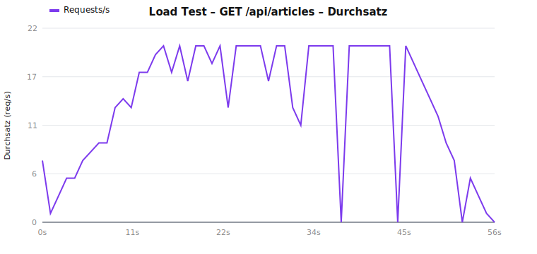
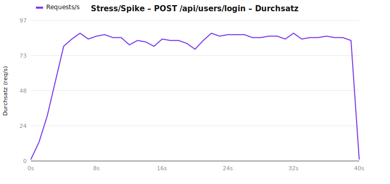

# Testbericht – conduit-realworld-example-app

**Projektarbeit Web Application Testing**
**Beteiligte Personen:** Lorenz Seybold, Philipp Zauner
**Repository:** Fork von [TonyMckes/conduit-realworld-example-app](https://github.com/TonyMckes/conduit-realworld-example-app)

---

## 1. Die getestete Webanwendung (Kurzbeschreibung)

`conduit` ist die Referenz-Implementierung der **RealWorld**-Spezifikation – ein „Medium-Klon" (Blogging-Plattform) mit Registrierung/Login, Artikeln (CRUD), Kommentaren, Tags, Favoriten und Folgen von Autoren. Die Anwendung ist ein **Monorepo** (npm-Workspaces) mit zwei Teilen:

| Teil | Technologie | Aufgabe |
|---|---|---|
| **Backend** (`backend/`) | Node.js, **Express 5**, **Sequelize 6** (ORM), **PostgreSQL**, JWT (`jsonwebtoken`), `bcrypt` | REST-API unter `/api/...` (users, user, articles, profiles, tags, comments, favorites) |
| **Frontend** (`frontend/`) | **React 19**, Vite + SWC, react-router-dom 7, axios | SPA, spricht das Backend über einen `/api`-Proxy an |

Architektur des Backends: klassische Schichtung in `routes/` → `controllers/` → `models/`, mit Helfern (`helper/`) und Middleware (`middleware/`) für Authentifizierung und Fehlerbehandlung.

---

## 2. Ausgangslage und gewählte Strategie

### 2.1 Vorhandene Tests und Original-Coverage

Im Fork war bereits **Vitest** eingerichtet (3 Testdateien, 12 Tests – ausschließlich triviale Helfer: `slugify`, `dateFormatter`, `errorHandler` im Frontend). Die gemessene **Original-Coverage** lag entsprechend bei:

| Metrik | Statements | Branches | Functions | Lines |
|---|---|---|---|---|
| **Baseline (nur Upstream-Tests)** | **1,28 %** | 0,58 % | 1,44 % | 1,39 % |

Praktisch der gesamte fachliche Code (Controller, Models, Auth, Middleware, React-Komponenten) war **ungetestet**.

### 2.2 Strategieentscheidung

Die Aufgabe ließ zwei Wege zu: (a) bestehende Suite gezielt erweitern oder (b) eine **eigene Suite mit einem anderen Framework** aufbauen. Wir haben uns für **(b)** entschieden:

> Die bestehende **Vitest**-Suite bleibt unverändert als dokumentierte Baseline bestehen. Unsere eigenen Tests bauen wir bewusst mit **Jest** (Unit/Integration), **Playwright** (E2E) und **k6** (Load) auf.

Begründung: Das Backend ist CommonJS – ideal für Jest. Die klare Trennung „Upstream-Baseline (Vitest) vs. eigene Suite (Jest/Playwright/k6)" macht den eigenen Beitrag eindeutig nachvollziehbar, ohne die Ausgangsmessung zu verfälschen. Vitest und Jest sind über `include`/`testMatch` sauber voneinander abgegrenzt.

---

## 3. Das Test-Setup im Überblick

### 3.1 Eingesetzte Frameworks

| Stufe | Framework | DB | Verzeichnis |
|---|---|---|---|
| Unit | **Jest 29** | – (Mocks) | `tests/unit/` |
| Integration | **Jest 29 + Supertest 7** | **PostgreSQL** (Docker) | `tests/integration/` |
| System/E2E | **Playwright** | **PostgreSQL** (Docker) | `e2e/` |
| Load | **k6** | PostgreSQL (Docker) | `load/` |
| (Baseline) | Vitest 4 | – | `frontend/…`, `backend/helper/…` |

### 3.2 Datenbank-Strategie: warum echtes PostgreSQL statt SQLite

Bewusste Entscheidung gegen eine In-Memory-SQLite-DB: Die App ist über Sequelize an **PostgreSQL** gebunden, und gerade die fachlich interessanten Integrationsfälle (Unique-Constraints auf E-Mail und Artikel-Slug, Fehlertypen, Such-/Filterverhalten) können auf SQLite **falsch-positiv** „grün" werden. Für **realistische Szenarien** ist Produktions-Parität entscheidend. PostgreSQL läuft lokal und in CI per **`docker-compose.yml`** (Container `conduit-postgres`, Datenbanken `database_development` + `database_testing`).

### 3.3 Test-Isolation (zentrale Qualitätsanforderung)

| Stufe | Isolationsmechanismus |
|---|---|
| **Unit** | Keine externen Abhängigkeiten; `jwt`-Helper und `User`-Modell in der Auth-Middleware werden **gemockt** (`jest.mock`). Vollständig deterministisch. |
| **Integration** | Eigene Test-DB `database_testing`. Pro Testdatei frisches Schema (`sequelize.sync({ force: true })`), **vor jedem Test** `truncate({ cascade, restartIdentity })` → jeder Test startet leer. Serielle Ausführung (`--runInBand`). Helfer: `tests/helpers/db.js`. |
| **E2E** | Dedizierte Test-DB; jeder Test erzeugt einen **eindeutigen Benutzer** (Zeitstempel + Zufall) → unabhängige, über Läufe wiederholbare Flows ohne Datenkollision. Serielle Ausführung (`workers: 1`). |
| **Load** | Vor dem Lauf Schema-Reset; Szenarien seeden ihre eigenen Daten in `setup()`. |

Für Supertest musste die Express-App testbar gemacht werden: **`backend/app.js`** exportiert nun die konfigurierte App **ohne** `listen`/DB-Sync; `backend/index.js` importiert sie und startet den realen Server. Verhalten in Dev/Prod unverändert.

Zusätzlich wurde ein Konfigurationsfehler behoben: `backend/config/config.js` reichte den Umgebungswert `logging` als String durch (Sequelize erwartet `false` oder eine Funktion) – jetzt korrekt zu Boolean/Funktion gewandelt.

### 3.4 Ausführung (reproduzierbare Befehle)

Voraussetzungen: Node.js, Docker Desktop. Einmalig `npm install`.

```bash
# 1) Test-Datenbank starten (PostgreSQL via Docker)
npm run db:up

# 2) Unit-Tests (Jest, ohne DB)
npm run test:unit

# 3) Integrationstests (Jest + Supertest, gegen PostgreSQL)
npm run test:integration

# 4) Unit + Integration zusammen, mit Coverage
npm run test:jest:coverage

# 5) E2E-Tests (Playwright startet Backend + Frontend automatisch)
npm run test:e2e

# 6) Load-Tests (k6) + Auswertung/Diagramme
npm run test:load
npm run test:load:report

# (Baseline) Upstream-Vitest-Suite
npm run test:vitest

# Datenbank stoppen
npm run db:down
```

---

## 4. Die Tests im Detail – und warum es so viele sind

Mindestanforderung (Summe 2er-Team): **10 Unit, 6 Integration, 4 E2E, 2 Load = 22**. Umgesetzt:

| Stufe | Anzahl | Mindestens | Status |
|---|---|---|---|
| Unit | **30** | 10 | ✅ |
| Integration | **19** | 6 | ✅ |
| System/E2E | **5** | 4 | ✅ |
| Load | **2** | 2 | ✅ |
| **Summe** | **56** | 22 | ✅ |

Die Überschreitung ist **kein Padding**, sondern ergibt sich aus dem Prinzip *„ein Test pro fachlich eigenständigem Pfad/Edge-Case"*. Begründung im Detail:

### 4.1 Warum 30 Unit-Tests (statt 10)

Getestet werden die **sicherheits- und logikkritischen** Bausteine. Jeder Test deckt einen **eigenen Code-Pfad bzw. eine eigene Eigenschaft** ab – würde man kürzen, bliebe jeweils echtes Verhalten ungetestet:

| Modul | Tests | Distinkte Pfade/Eigenschaften (warum nicht weniger) |
|---|---|---|
| `helper/bcrypt` | 4 | Hash ≠ Klartext **und** bcrypt-Format; korrekte Verifikation; **falsche** Verifikation; **Salting** (zwei Hashes verschieden). Jede Zeile prüft eine andere Sicherheitsgarantie. |
| `helper/jwt` | 4 | Token-Struktur; **keine sensiblen Felder** im Token (Sicherheit); Round-Trip; **Manipulation wirft**. |
| `helper/helpers` (`slugify`) | 4 | Edge-Cases jenseits der Baseline: Normalfall, Ziffern, Mehrfach-Sonderzeichen, Unicode-Grenze. |
| `helper/customErrors` | 8 | 5× Message-Format **+ 3× Vererbung**. Die Vererbung ist nicht trivial: der zentrale `errorHandler` entscheidet per `instanceof` über den HTTP-Status – fällt z. B. `FieldRequiredError instanceof ValidationError` weg, bricht das 422-Mapping. |
| `middleware/errorHandler` | 6 | Je ein Test pro Status-Zweig (401/403/404/422/500) **+ Response-Schema**. Weniger Tests = ungetestete Verzweigungen. |
| `middleware/authentication` | 4 | Kein Header → Durchlauf; malformed Token → `SyntaxError`; gültig + User; gültig + kein User → `NotFoundError`. Das sind die vier realen Verzweigungen der Funktion. |

Konkret: Eine Reduktion auf 10 würde z. B. das Salting (Sicherheit), die `instanceof`-Hierarchie (Grundlage des Fehler-Mappings) oder einzelne Status-Zweige des `errorHandler` ungetestet lassen – also genau die Stellen, an denen ein Refactoring unbemerkt brechen könnte.

### 4.2 Warum 19 Integration-Tests (statt 6)

Pro REST-Ressource wird **nicht nur der Happy Path**, sondern auch der **Fehler-/Vertragspfad** getestet. In einer echten API ist der Fehlerkontrakt (Statuscodes 401/403/404/422) ebenso wichtig wie der Erfolgsfall – und es sind genau die Pfade, an denen das PostgreSQL-/Constraint-Verhalten zum Tragen kommt:

| Datei | Tests | Abgedeckte Pfade |
|---|---|---|
| `auth.test.js` | 8 | Register: 201 + Token + **kein Passwort-Leak**; fehlendes Feld → 422; **Duplikat-E-Mail → 422** (Unique-Constraint). Login: Erfolg; falsches Passwort → 422; unbekannte E-Mail → 404. Current-User: 401 ohne Token; 200 mit Token. |
| `articles.test.js` | 7 | Create: **Auth-Pflicht (401)**; Slug-Ableitung; **Duplikat-Slug → 422**; fehlender Titel → 422. Read: Round-Trip per Slug; 404 bei unbekanntem Slug; Liste mit Count. |
| `comments-tags.test.js` | 4 | Kommentar anlegen (201) + Auflisten; leerer Body → 422; Tags-Endpunkt; **404-Fallback** für unbekannte Routen. |

Eine Reduktion auf 6 würde bedeuten, fast alle **Negativ-/Fehlerpfade** zu streichen – also Validierung, Authentifizierung und Constraint-Verhalten, die erfahrungsgemäß am häufigsten regressieren.

### 4.3 Wirkung auf die Coverage (Beleg, dass die Tests „greifen")

Unit + Integration zusammen heben die Backend-Coverage von **1,28 %** auf:

| Bereich | Statements | Branches | Functions | Lines |
|---|---|---|---|---|
| **Gesamt (Backend)** | **71,66 %** | 46,15 % | 78,43 % | 74,94 % |
| `helper/` | 100 % | 66,7 % | 100 % | 100 % |
| `middleware/` | 97,6 % | 93,8 % | 100 % | 100 % |
| `models/` | 98 % | 71,4 % | 93,3 % | 98 % |
| `routes/` | ~98–100 % | 100 % | 100 % | ~98 % |
| `controllers/` | 53 % | 33,3 % | 44,4 % | 56,5 % |

Die nicht abgedeckten Controller (`favorites`, `profiles`, Teile von `articles`) sind bewusst **ehrlich ausgewiesen**: Sie zeigen den nächsten sinnvollen Ausbauschritt, ohne dass wir die Zahlen mit Trivial-Tests „schönen".

### 4.4 System-/E2E-Tests (5)

Echte Browser-Flows mit Playwright (Chromium), Backend + Frontend werden automatisch hochgefahren:

| Datei | Flow |
|---|---|
| `e2e/auth.spec.js` | Registrierung → eingeloggt; Login über Formular; **ungültiger Login → Fehlermeldung**; Logout → ausgeloggte Navigation |
| `e2e/article.spec.js` | Eingeloggt einen Artikel verfassen → Veröffentlichen → Artikel-Detailseite zeigt den Titel |

Der fünfte Test (Logout) über die Mindestanzahl hinaus deckt den vollständigen Auth-Lebenszyklus (an/abmelden) ab und ist daher fachlich gerechtfertigt.

---

## 5. CI/CD-Pipeline (GitHub Actions, self-hosted Runner)

Zwei Workflows, ausgelegt für einen **self-hosted Runner (Windows + Docker)**. Da `services:`-Container auf Windows-Runnern nicht unterstützt werden, wird PostgreSQL portabel per **`docker compose`** bereitgestellt; alle Schritte laufen in `shell: bash` (Git Bash) → identisch auf Windows und Linux.

**`.github/workflows/ci.yml`** (bei Push/PR auf `main`):
1. Checkout → Node 22 (npm-Cache) → `npm ci`
2. `npx playwright install chromium`
3. `docker compose up -d db` + Healthcheck-Warteschleife
4. `npm run lint --if-present` (Platzhalter, bis ein Linter ergänzt wird)
5. **Alle Teststufen nacheinander:** Vitest-Baseline → Jest Unit → Jest Integration → Playwright E2E
6. Playwright-Report als Artifact, danach `docker compose down`

**`.github/workflows/load.yml`** (`workflow_dispatch`, **manuell**): startet DB + Backend, führt beide k6-Szenarien aus, erzeugt die Diagramme und lädt `load/charts/` + `summary.md` als Artifact hoch. Bewusst getrennt, da Load-Tests ressourcenintensiv und nicht für jeden Push gedacht sind.

DB-Zugangsdaten und `JWT_KEY` kommen als Job-`env:` (kein `.env` im Repo nötig); `NODE_ENV=test` setzen die npm-Skripte selbst via `cross-env`. Der Runner setzt automatisch `CI=true`, wodurch Playwright eigene Server startet (`reuseExistingServer:false`), `forbidOnly` aktiviert und einen Retry erlaubt.

*Voraussetzungen auf dem Runner:* Label `self-hosted`, installiert Docker Desktop, Node, Git Bash; für den Load-Workflow zusätzlich **k6** im PATH.

---

## 6. Load-Tests (k6): Art, Zweck, Ergebnisse und Analyse

Zwei Szenarien gegen die zentralen API-Endpunkte (Backend im Test-Modus gegen die Docker-PostgreSQL). Beide definieren **Thresholds** (Pass/Fail-Kriterien für Latenz und Fehlerrate).

| Test | Art | Zweck | Lastprofil |
|---|---|---|---|
| `load/articles-load.js` | **Last-/Throughput-Test** | Verhalten des meistgenutzten Lese-Endpunkts `GET /api/articles` unter steigender Last | Ramp 0→20 VUs (15 s), Plateau 20 VUs (30 s), Ramp-down (10 s) |
| `load/auth-stress.js` | **Stress-/Spike-Test** | Den CPU-intensiven Login-Pfad `POST /api/users/login` (bcrypt) gezielt überlasten und die Kapazitätsgrenze finden | Warmup→10 VUs, **Spike auf 100 VUs**, Halten 100 VUs (20 s), Ramp-down |

### 6.1 Ergebnisübersicht

| Test | Requests | Fehler % | avg | p90 | p95 | max | max VUs |
|---|---|---|---|---|---|---|---|
| GET /api/articles (Load) | 776 | 0,00 | 115 ms | 202 ms | **238 ms** | 304 ms | 20 |
| POST /api/users/login (Stress/Spike) | 3136 | 0,00 | 831 ms | 1209 ms | **1228 ms** | 1307 ms | 100 |

### 6.2 Visualisierung

**Lesepfad `GET /api/articles` – Latenz & Last**




**Auth-Pfad `POST /api/users/login` – Latenz & Last (Spike)**




### 6.3 Analyse

**1. Lesepfad ist gesund.** Bei 20 gleichzeitigen Nutzern bleibt p95 mit **238 ms** klar unter dem Schwellwert (500 ms), 0 % Fehler. Die Latenz wird von Datenbankabfragen dominiert: Pro Artikel werden mehrere Folgeabfragen ausgeführt (`appendFollowers`/`appendFavorites` – ein klassisches **N+1-Query-Muster**). Im getesteten Bereich ist das unkritisch, bei deutlich größeren Listen/Last wäre es der erste Optimierungskandidat (Eager Loading / Aggregation).

**2. Auth-Pfad zeigt eine klare Kapazitätsgrenze (Engpass).**
- Bei niedriger Last (≤ 10 VUs): avg ≈ **70 ms**.
- Mit dem Spike auf 100 VUs steigt die Latenz steil an und plateaut bei **≈ 1,15–1,3 s** (rund **17×** langsamer), der Durchsatz deckelt bei **≈ 78 req/s**.
- **Ursache:** `bcryptCompare` mit Cost-Faktor 10 ist absichtlich rechenintensiv. Node.js verarbeitet das auf wenigen Threads; sobald die CPU sättigt, wachsen Requests in der Warteschlange → die Latenz steigt linear mit der Nebenläufigkeit, während der Durchsatz konstant bleibt (typisches Bild eines **CPU-gebundenen** Engpasses).
- **Bewertung:** Funktional korrekt (0 % Fehler), aber begrenzt skalierbar. Der Engpass liegt **nicht** in der Datenbank, sondern in der CPU-gebundenen Hash-Operation. Mögliche Maßnahmen: horizontale Skalierung (mehr Instanzen hinter einem Load Balancer), Rate-Limiting am Login-Endpunkt, oder eine bewusste Abwägung des bcrypt-Cost-Faktors (Sicherheit ↔ Durchsatz).

**Fazit Load:** Lesepfade skalieren im getesteten Bereich problemlos; der Auth-Endpunkt ist der erwartbare, sicherheitsbedingte Flaschenhals. Die Tests bestätigen damit die Designentscheidung für eine realistische DB – die Engpässe sind reproduzierbar messbar.

---

## 7. Reproduzierbarkeit & Zusammenfassung

- **Lokal reproduzierbar:** Alle Stufen über die in Abschnitt 3.4 dokumentierten Befehle; einzige Voraussetzung Node + Docker.
- **Isoliert:** Unit ohne externe Abhängigkeiten; Integration mit Schema-Reset + Truncate pro Test; E2E mit eindeutigen Daten; eigene Test-DB getrennt von Entwicklung.
- **Automatisiert:** CI-Workflow führt Lint + alle Teststufen aus; Load-Tests separat manuell.
- **Mengengerüst erfüllt:** 30 Unit + 19 Integration + 5 E2E + 2 Load = **56 Tests** (Minimum 22).
- **Coverage:** Backend von **1,28 % → 71,66 %** Statements.

---

## 8. Deklaration

**Beteiligte Personen:** Lorenz Seybold, Philipp Zauner.

**Eingesetzte KI-Werkzeuge:** Claude Code (Anthropic, Modell Claude Opus 4.8) wurde als Pair-Programming-Unterstützung für die Erstellung des Test-Setups, der Tests, der CI-Konfiguration und dieser Dokumentation verwendet. Alle Inhalte wurden geprüft und durch lokale Testläufe verifiziert.
