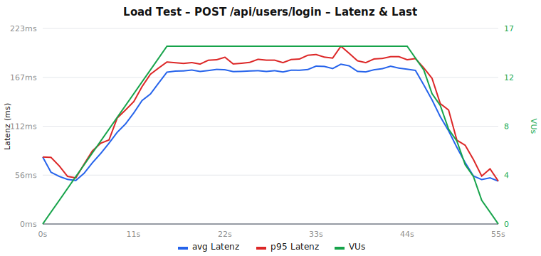
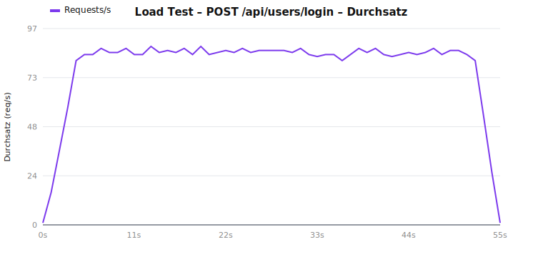
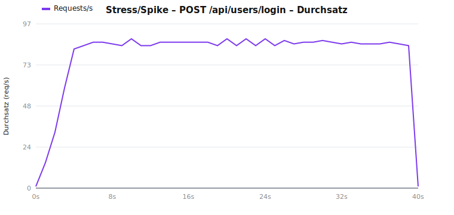

# Testbericht – conduit-realworld-example-app

**Projektarbeit Web Application Testing**
**Beteiligte Personen:** Lorenz Seybold, Philipp Zauner
**Repository:** Fork von [TonyMckes/conduit-realworld-example-app](https://github.com/TonyMckes/conduit-realworld-example-app)

---

## 1. Die getestete Webanwendung (Kurzbeschreibung)

`conduit` ist die Referenz-Implementierung der **RealWorld**-Spezifikation – ein „Medium-Klon" (Blogging-Plattform) mit Registrierung/Login, Artikeln (CRUD), Kommentaren, Tags, Favoriten und Folgen von Autoren. Die Anwendung ist ein **Monorepo** (npm-Workspaces) mit zwei Teilen:

| Teil | Technologie | Aufgabe |
|---|---|---|
| **Backend** (`backend/`) | Node.js, **Express 5**, **Sequelize 6** (ORM), **PostgreSQL**, JWT (`jsonwebtoken`), `bcrypt` | REST-API unter `/api/...` (users, user, articles, profiles, tags, comments, favorites) |
| **Frontend** (`frontend/`) | **React 19**, Vite + SWC, react-router-dom 7, axios | SPA, spricht das Backend über einen `/api`-Proxy an |

Architektur des Backends: klassische Schichtung in `routes/` → `controllers/` → `models/`, mit Helfern (`helper/`) und Middleware (`middleware/`) für Authentifizierung und Fehlerbehandlung.

> **Testumfang:** Die Aufgabenstellung verlangt die Abdeckung eines *Teilbereichs* der App. Diese Arbeit fokussiert den **Authentifizierungs-/Login-Bereich** (Registrierung, Login, Session) und testet ihn über alle vier Stufen der Testpyramide.

---

## 2. Ausgangslage und gewählte Strategie

### 2.1 Vorhandene Tests und Original-Coverage

Im Fork war bereits **Vitest** eingerichtet (3 Testdateien, 12 Tests – ausschließlich triviale Helfer: `slugify`, `dateFormatter`, `errorHandler` im Frontend). Die gemessene **Original-Coverage** lag entsprechend bei:

| Metrik | Statements | Branches | Functions | Lines |
|---|---|---|---|---|
| **Baseline (nur Upstream-Tests)** | **1,28 %** | 0,58 % | 1,44 % | 1,39 % |

Praktisch der gesamte fachliche Code (Controller, Models, Auth, Middleware, React-Komponenten) war **ungetestet**.

### 2.2 Strategieentscheidung

Die Aufgabe ließ zwei Wege zu: (a) bestehende Suite gezielt erweitern oder (b) eine **eigene Suite mit einem anderen Framework** aufbauen. Wir haben uns für **(b)** entschieden:

> Die bestehende **Vitest**-Suite bleibt unverändert als dokumentierte Baseline bestehen. Unsere eigenen Tests bauen wir bewusst mit **Jest** (Unit/Integration), **Playwright** (E2E) und **k6** (Load) auf.

Begründung: Das Backend ist CommonJS – ideal für Jest. Die klare Trennung „Upstream-Baseline (Vitest) vs. eigene Suite (Jest/Playwright/k6)" macht den eigenen Beitrag eindeutig nachvollziehbar, ohne die Ausgangsmessung zu verfälschen. Vitest und Jest sind über `include`/`testMatch` sauber voneinander abgegrenzt.

---

## 3. Das Test-Setup im Überblick

### 3.1 Eingesetzte Frameworks

| Stufe | Framework | DB | Verzeichnis                      |
|---|---|---|----------------------------------|
| Unit | **Jest 29** | – (Mocks) | `tests/unit/`                    |
| Integration | **Jest 29 + Supertest 7** | **PostgreSQL** (Docker) | `tests/integration/`             |
| System/E2E | **Playwright** | **PostgreSQL** (Docker) | `tests/e2e/`                     |
| Load | **k6** | PostgreSQL (Docker) | `tests/load/`                    |
| (Baseline) | Vitest 4 | – | `frontend/…`, `backend/helper/…` |

### 3.2 Datenbank-Strategie: warum echtes PostgreSQL statt SQLite

Bewusste Entscheidung gegen eine In-Memory-SQLite-DB: Die App ist über Sequelize an **PostgreSQL** gebunden, und gerade die fachlich interessanten Integrationsfälle (Unique-Constraints auf E-Mail und Artikel-Slug, Fehlertypen, Such-/Filterverhalten) können auf SQLite **falsch-positiv** „grün" werden. Für **realistische Szenarien** ist Produktions-Parität entscheidend. PostgreSQL läuft lokal und in CI per **`docker-compose.yml`** (Container `conduit-postgres`, Datenbanken `database_development` + `database_testing`).

### 3.3 Test-Isolation (zentrale Qualitätsanforderung)

| Stufe | Isolationsmechanismus |
|---|---|
| **Unit** | Keine externen Abhängigkeiten; `jwt`-Helper und `User`-Modell in der Auth-Middleware werden **gemockt** (`jest.mock`). Vollständig deterministisch. |
| **Integration** | Eigene Test-DB `database_testing`. Pro Testdatei frisches Schema (`sequelize.sync({ force: true })`), **vor jedem Test** `truncate({ cascade, restartIdentity })` → jeder Test startet leer. Serielle Ausführung (`--runInBand`). Helfer: `tests/helpers/db.js`. |
| **E2E** | Dedizierte Test-DB; jeder Test erzeugt einen **eindeutigen Benutzer** (Zeitstempel + Zufall) → unabhängige, über Läufe wiederholbare Flows ohne Datenkollision. Serielle Ausführung (`workers: 1`). |
| **Load** | Vor dem Lauf Schema-Reset; Szenarien seeden ihre eigenen Daten in `setup()`. |

Für Supertest musste die Express-App testbar gemacht werden: **`backend/app.js`** exportiert nun die konfigurierte App **ohne** `listen`/DB-Sync; `backend/index.js` importiert sie und startet den realen Server. Verhalten in Dev/Prod unverändert.

Zusätzlich wurde ein Konfigurationsfehler behoben: `backend/config/config.js` reichte den Umgebungswert `logging` als String durch (Sequelize erwartet `false` oder eine Funktion) – jetzt korrekt zu Boolean/Funktion gewandelt.

### 3.4 Ausführung (reproduzierbare Befehle)

Voraussetzungen: Node.js, Docker Desktop. Einmalig `npm install`.

```bash
# 1) Test-Datenbank starten (PostgreSQL via Docker)
npm run db:up

# 2) Unit-Tests (Jest, ohne DB)
npm run test:unit

# 3) Integrationstests (Jest + Supertest, gegen PostgreSQL)
npm run test:integration

# 4) Unit + Integration zusammen, mit Coverage
npm run test:jest:coverage

# 5) E2E-Tests (Playwright startet Backend + Frontend automatisch)
npm run test:e2e

# 6) Load-Tests (k6) + Auswertung/Diagramme
npm run test:load
npm run test:load:report

# (Baseline) Upstream-Vitest-Suite
npm run test:vitest

# Datenbank stoppen
npm run db:down
```

---

## 4. Die Tests im Detail (Fokus: Authentifizierung/Login)

Laut Aufgabenstellung muss **nicht die gesamte App**, sondern ein **fachlicher Teilbereich** abgedeckt werden. Wir haben uns bewusst auf den **Authentifizierungs-/Login-Bereich** konzentriert (Registrierung, Login, Session/„Current User") und diesen über **alle vier Stufen der Testpyramide** getestet. Die geforderten Mindestmengen (≥10/6/4/2 = 22) sind dabei eingehalten:

| Stufe | Anzahl | Mindestens | Status |
|---|---|---|---|
| Unit | **12** | 10 | ✅ |
| Integration | **8** | 6 | ✅ |
| System/E2E | **4** | 4 | ✅ |
| Load | **2** | 2 | ✅ |
| **Summe** | **26** | 22 | ✅ |

Jeder Test deckt einen **eigenen Code-Pfad bzw. eine eigene Eigenschaft** des Login-Bereichs ab – kein Padding.

### 4.1 Unit-Tests (12) – die sicherheitskritischen Auth-Bausteine

| Modul | Tests | Distinkte Pfade/Eigenschaften |
|---|---|---|
| `helper/bcrypt` | 4 | Hash ≠ Klartext **und** bcrypt-Format; korrekte Verifikation; **falsche** Verifikation; **Salting** (zwei Hashes verschieden). |
| `helper/jwt` | 4 | Token-Struktur; **keine sensiblen Felder** im Token; Round-Trip; **Manipulation wirft**. |
| `middleware/authentication` | 4 | Kein Header → Durchlauf; malformed Token → `SyntaxError`; gültig + User; gültig + kein User → `NotFoundError`. |

Das sind exakt die Module, die **Passwort-Hashing, Token-Handling und die Absicherung geschützter Routen** umsetzen – jede Zeile prüft eine eigene Sicherheits-/Verhaltensgarantie (z. B. dass Tokens kein Passwort enthalten oder dass Hashes gesalzen sind).

### 4.2 Integration-Tests (8) – die Auth-Endpunkte end-to-end

`tests/integration/auth.test.js` prüft gegen echtes PostgreSQL je **Happy Path und Fehlerkontrakt**:

| Bereich | Geprüfte Pfade |
|---|---|
| Register | 201 + Token + **kein Passwort-Leak**; fehlendes Feld → 422; **Duplikat-E-Mail → 422** (Unique-Constraint) |
| Login | Erfolg + Token; falsches Passwort → 422; unbekannte E-Mail → 404 |
| Current-User | 401 ohne Token; 200 mit Token |

Gerade die Fehlerpfade (401/422/404) und der Unique-Constraint sind der Grund für die **echte DB** statt SQLite.

### 4.3 System-/E2E-Tests (4) – der Login-Lebenszyklus im Browser

Playwright (Chromium), Backend + Frontend werden automatisch gestartet. `tests/e2e/auth.spec.js`:
Registrierung → eingeloggt; Login über das Formular; **ungültiger Login → Fehlermeldung**; Logout → ausgeloggte Navigation. Damit ist der vollständige An-/Abmelde-Lebenszyklus abgedeckt.

### 4.4 Wirkung auf die Coverage (Auth-Bereich)

Passend zum Fokus wird die Coverage über die **auth-relevanten Module** gemessen (`bcrypt`, `jwt`, `authentication`, `controllers/users`+`user`, `routes/users`+`user`, `models/User`). Gegenüber der Baseline von **1,28 %** (gesamtes Backend, ungetestet):

| Bereich (Auth-Slice) | Statements | Branches | Functions | Lines |
|---|---|---|---|---|
| **Gesamt** | **85,3 %** | 59,4 % | 84,6 % | 88,3 % |
| `bcrypt.js`, `jwt.js` | 100 % | 100 % | 100 % | 100 % |
| `middleware/authentication.js` | 95,5 % | 87,5 % | 100 % | 100 % |
| `models/User.js`, `routes/user(s).js` | 100 % | 100 % | 100 % | 100 % |
| `controllers/users.js` | 93,9 % | 83,3 % | 100 % | 100 % |

Nicht vollständig abgedeckt ist `controllers/user.js`: dessen `updateUser`-Funktion (Profil ändern) liegt außerhalb des getesteten Login-/Register-/Current-User-Flows – bewusst ehrlich ausgewiesen.

---

## 5. CI/CD-Pipeline (GitHub Actions, self-hosted Runner)

Zwei Workflows, ausgelegt für einen **self-hosted Runner (Windows + Docker)**. Da `services:`-Container auf Windows-Runnern nicht unterstützt werden, wird PostgreSQL portabel per **`docker compose`** bereitgestellt. Es wird **bewusst keine bash erzwungen**: Auf Windows-Runnern würde `shell: bash` sonst die WSL-Bash treffen, die Windows-Pfade nicht versteht. Stattdessen nutzen die Schritte die Standard-Shell (PowerShell) und einzeilige Befehle.

**`.github/workflows/ci.yml`** (bei Push/PR auf `main`):
1. Checkout → Node 22 (npm-Cache) → `npm ci`
2. `npx playwright install chromium`
3. `docker compose up -d --wait db` (wartet, bis die DB „healthy" ist)
4. `npm run lint --if-present` (Platzhalter, bis ein Linter ergänzt wird)
5. **Alle Teststufen nacheinander:** Vitest-Baseline → Jest Unit → Jest Integration → Playwright E2E
6. Playwright-Report als Artifact, danach `docker compose down`

**`.github/workflows/load.yml`** (`workflow_dispatch`, **manuell**): ruft `npm run test:load:local` auf, das DB + Backend startet (via `start-server-and-test`), beide k6-Szenarien ausführt, die Diagramme erzeugt und das Backend wieder stoppt; anschließend werden `tests/load/charts/` + `summary.md` als Artifact hochgeladen. Bewusst getrennt, da Load-Tests ressourcenintensiv und nicht für jeden Push gedacht sind.

DB-Zugangsdaten und `JWT_KEY` kommen als Job-`env:` (kein `.env` im Repo nötig); `NODE_ENV=test` setzen die npm-Skripte selbst via `cross-env`. Der Runner setzt automatisch `CI=true`, wodurch Playwright eigene Server startet (`reuseExistingServer:false`), `forbidOnly` aktiviert und einen Retry erlaubt.

*Voraussetzungen auf dem Runner:* Label `self-hosted`, installiert Docker Desktop und Node; für den Load-Workflow zusätzlich **k6** im PATH.

---

## 6. Load-Tests (k6): Art, Zweck, Ergebnisse und Analyse

Passend zum Auth-Fokus zielen **beide** Szenarien auf den Login-Endpunkt `POST /api/users/login` – einmal unter normaler Last, einmal als Überlast. Beide definieren **Thresholds** (Pass/Fail-Kriterien für Latenz und Fehlerrate). Backend im Test-Modus gegen die Docker-PostgreSQL.

| Test | Art | Zweck | Lastprofil |
|---|---|---|---|
| `tests/load/login-load.js` | **Last-/Throughput-Test** | Verhalten des Logins unter **realistischer Normallast** | Ramp 0→15 VUs (15 s), Plateau 15 VUs (30 s), Ramp-down (10 s) |
| `tests/load/auth-stress.js` | **Stress-/Spike-Test** | Den CPU-intensiven Login-Pfad (bcrypt) gezielt **überlasten** und die Kapazitätsgrenze finden | Warmup→10 VUs, **Spike auf 100 VUs**, Halten 100 VUs (20 s), Ramp-down |

### 6.1 Ergebnisübersicht

| Test | Requests | Fehler % | avg | p90 | p95 | max | max VUs |
|---|---|---|---|---|---|---|---|
| Login – Last (15 VUs) | 4357 | 0,00 | 146 ms | 185 ms | **188 ms** | 210 ms | 15 |
| Login – Stress/Spike (100 VUs) | 3186 | 0,00 | 818 ms | 1169 ms | **1171 ms** | 1179 ms | 100 |

### 6.2 Visualisierung

**Login unter Normallast (15 VUs)**





**Login unter Spike (100 VUs)**




### 6.3 Analyse

**1. Normallast ist unkritisch.** Bei 15 gleichzeitigen Nutzern bleibt p95 mit **188 ms** klar unter dem Schwellwert (1 s), 0 % Fehler, stabiles Plateau. Der Login verhält sich unter erwarteter Last unauffällig.

**2. Unter Überlast zeigt sich eine klare Kapazitätsgrenze.**
- Bei niedriger Last: min ≈ **47 ms**, avg ≈ 150 ms.
- Mit dem Spike auf 100 VUs steigt die Latenz steil an und plateaut bei **≈ 1,17 s** (p95) – derselbe Endpunkt ist damit rund **6× langsamer** als unter Normallast (188 ms → 1171 ms).
- **Ursache:** `bcryptCompare` mit Cost-Faktor 10 ist absichtlich rechenintensiv. Node.js verarbeitet das auf wenigen Threads; sobald die CPU sättigt, wachsen Requests in der Warteschlange → die Latenz steigt mit der Nebenläufigkeit, während der Durchsatz deckelt (typisches Bild eines **CPU-gebundenen** Engpasses).
- **Bewertung:** Funktional korrekt (0 % Fehler), aber begrenzt skalierbar. Der Engpass liegt **nicht** in der Datenbank, sondern in der CPU-gebundenen Hash-Operation. Mögliche Maßnahmen: horizontale Skalierung (mehr Instanzen hinter einem Load Balancer), Rate-Limiting am Login-Endpunkt, oder eine bewusste Abwägung des bcrypt-Cost-Faktors (Sicherheit ↔ Durchsatz).

**Fazit Load:** Die direkte Gegenüberstellung *gleicher Endpunkt, unterschiedliche Last* lokalisiert die Grenze des Login-Pfads klar und reproduzierbar – der erwartbare, sicherheitsbedingte Flaschenhals (bcrypt) ist messbar belegt.

---

## 7. Reproduzierbarkeit & Zusammenfassung

- **Lokal reproduzierbar:** Alle Stufen über die in Abschnitt 3.4 dokumentierten Befehle; einzige Voraussetzung Node + Docker.
- **Isoliert:** Unit ohne externe Abhängigkeiten; Integration mit Schema-Reset + Truncate pro Test; E2E mit eindeutigen Daten; eigene Test-DB getrennt von Entwicklung.
- **Automatisiert:** CI-Workflow führt Lint + alle Teststufen aus; Load-Tests separat manuell.
- **Fokus:** Authentifizierungs-/Login-Bereich, über alle vier Pyramidenstufen abgedeckt.
- **Mengengerüst erfüllt:** 12 Unit + 8 Integration + 4 E2E + 2 Load = **26 Tests** (Minimum 22).
- **Coverage (Auth-Slice):** von **1,28 % → 85,3 %** Statements.

---

## 8. Deklaration

**Beteiligte Personen:** Lorenz Seybold, Philipp Zauner.

**Eingesetzte KI-Werkzeuge:** Claude Code (Anthropic, Modell Claude Opus 4.8) wurde als Pair-Programming-Unterstützung für die Erstellung des Test-Setups, der Tests, der CI-Konfiguration und dieser Dokumentation verwendet. Alle Inhalte wurden geprüft und durch lokale Testläufe verifiziert.
